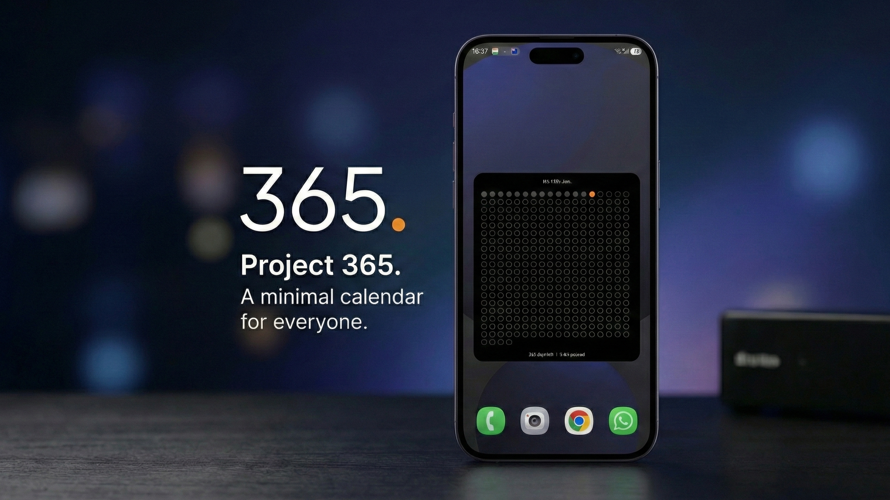
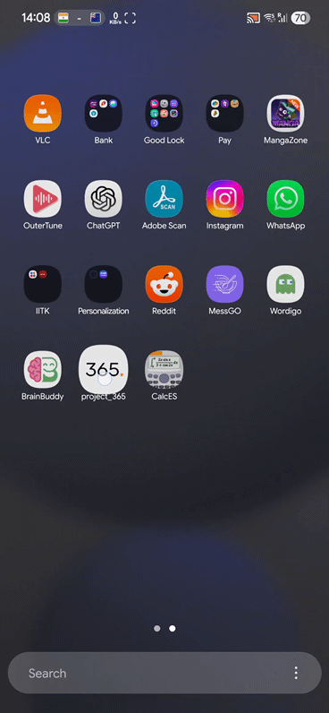

# 365.

> **The automated answer to the "Year in Pixels" wallpaper trend.**

 

 

## 📖 About

**365.** (pronounced "Three-Six-Five Dot") is a minimalist Android widget that visualizes your progress through the current year. It serves as a gentle, automated reminder of the passage of time, designed to keep you grounded and motivated without the manual effort of "Year in Pixels" trackers or complex journaling apps.

## ✨ Features

* **Year in Progress:** A visual grid of 365 dots representing every day of the year.
* **Dynamic Widget:** Resizable home screen widget that adapts layout automatically (4x2, 4x3, 4x4, etc.) to fit any screen size.
* **Smart State:**
    * **Past:** Dimmed/Grey dots.
    * **Today:** Glowing Orange pulse.
    * **Future:** Empty outlines.
* **Theme Support:** Toggle between **Light Mode** (E-Ink style) and **Dark Mode** (OLED friendly) directly from the widget settings.
* **Zero Friction:** Updates automatically at midnight. No manual input required.

## 🛠 How it Works

The core philosophy of **365.** is **minimal impact, maximum utility**.

### The Technical Challenge
One of the main challenges in building home screen widgets with Flutter is bridging the gap between the Dart VM and the native Android `AppWidgetProvider`.

Instead of running a heavy background isolate or completely detaching the UI engine, this project utilizes the **Flutter Home Widget** bridge for optimal performance and battery life.

* **Architecture**: The app calculates the temporal data (Day of Year, Leap Year logic) within the Flutter environment.
* **Data Sync**: We use **SharedPreferences** as a lightweight synchronization layer. The Dart code computes the state and serializes it to shared storage.
* **Native Rendering**: The Android widget is built with **Native Kotlin** and `RemoteViews`. It reads the shared state directly, ensuring the widget renders instantly even if the Flutter app isn't running in the background.
* **Responsive Grid**: The widget uses a native `GridView` with `auto_fit` columns and customized resource scaling to ensure all 365 dots fit perfectly on any screen size without scrolling.

## 🚀 Getting Started

1.  **Download** the latest APK from the [Releases](https://github.com/yourusername/project_365/releases) tab.
2.  **Install** the application on your Android device (ensure "Install from unknown sources" is enabled).
3.  **Open** the app once to initialize the counter.
4.  **Add** the "365 Widget" to your home screen.
5.  *(Optional)* Tap the widget or open settings to switch between Light/Dark themes.

## 🤝 Contributing

Contributions are what make the open source community such an amazing place to learn, inspire, and create. Any contributions you make are **greatly appreciated**.

1.  Fork the Project
2.  Create your Feature Branch (`git checkout -b feature/AmazingFeature`)
3.  Commit your Changes (`git commit -m 'Add some AmazingFeature'`)
4.  Push to the Branch (`git push origin feature/AmazingFeature`)
5.  Open a Pull Request